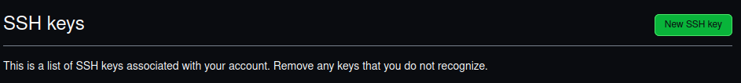
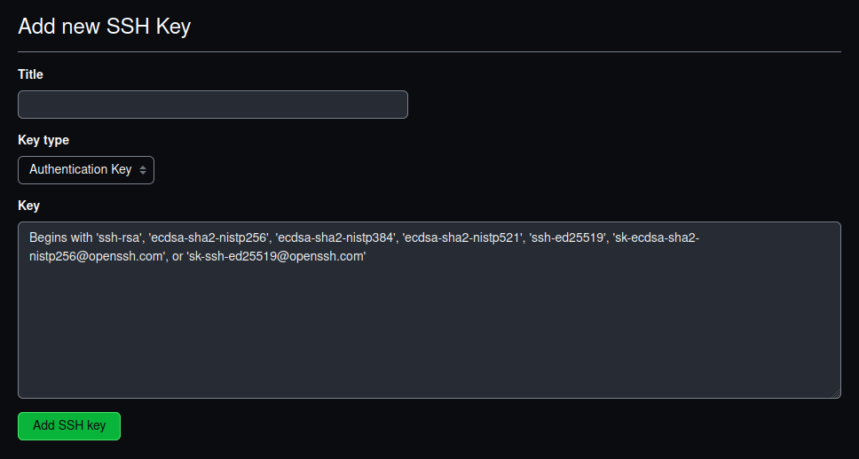

# Setting up a local development environment with Node.js and Git

## Install Node.js on Linux, Windows, and MacOS using ([nvm](https://github.com/nvm-sh/nvm))

nvm is a version manager for [node.js](https://nodejs.org/en/), designed to be installed per-user, and invoked per-shell. `nvm` works on any POSIX-compliant shell (sh, dash, ksh, zsh, bash), in particular on these platforms: unix, macOS, and [windows WSL](https://github.com/nvm-sh/nvm#important-notes).


## Installing NVM

To **install** or **update** nvm, you should use the following cURL(for Linux, and MacOS) or Wget ( for Windows Powershell users) command:

```sh
curl -o- https://raw.githubusercontent.com/nvm-sh/nvm/v0.39.7/install.sh | bash
```

```sh
wget -qO- https://raw.githubusercontent.com/nvm-sh/nvm/v0.39.7/install.sh | bash
```

Running either of the above commands downloads a script and runs it. The script clones the nvm repository to `~/.nvm`, and attempts to add the source lines from the snippet below to the correct profile file (`~/.bash_profile`, `~/.zshrc`, `~/.profile`, or `~/.bashrc`).


```sh
export NVM_DIR="$([ -z "${XDG_CONFIG_HOME-}" ] && printf %s "${HOME}/.nvm" || printf %s "${XDG_CONFIG_HOME}/nvm")"
[ -s "$NVM_DIR/nvm.sh" ] && \. "$NVM_DIR/nvm.sh" # This loads nvm
```

### Verify Installation

###### Reload your terminal, than check if nvm is installed properly

To verify that nvm has been installed, do:

```sh
command -v nvm
```

or 

```sh
nvm -v # to see the version number example: 0.39.3
```

If you want to see what versions are available to install:

```sh
nvm ls-remote
```

To install a specific version of node:

```sh
nvm install 14.7.0 # or 16.3.0, 12.22.1, etc
```

To install the Long-term Support (A.K.A Stable version) of node:

```sh
nvm install --lts
```

## Setting up Node.js on Windows

##### In Powershell

```sh
# installs fnm (Fast Node Manager)
winget install Schniz.fnm

# download and install Node.js
fnm use --install-if-missing 20

# verifies the right Node.js version is in the environment
node -v # should print `v20.14.0`

# verifies the right NPM version is in the environment
npm -v # should print `10.7.0`
```

or download the windows installer via ([Node Windows installer](https://nodejs.org/en/download/prebuilt-installer)) and follow install instructions

To verify that Node.js has been installed properly, in your shell type the following command:

```sh
node --version
```

## Setting up git on Linux

In your terminal type in the command that matches your linux distribution
For administrator privileges be sure to use `sudo`

### Debian/Ubuntu

For the latest stable version for your release of Debian/Ubuntu

```sh
apt-get install git
```

For Ubuntu, this PPA provides the latest stable upstream Git version

```sh
add-apt-repository ppa:git-core/ppa 

apt update

apt install git
```

### Fedora

##### (up to Fedora 21)

```sh
yum install git
```

##### (Fedora 22 and later)

```sh
dnf install git
```

### Gentoo

```sh
emerge --ask --verbose dev-vcs/git
```

### Arch Linux

```sh
pacman -S git
```

### openSUSE

```sh
zypper install git
```

### Mageia

```sh
urpmi git
```

### Nix/NixOS

```sh
nix-env -i git
```

### FreeBSD

```sh
pkg install git
```

### Solaris 9/10/11 ([OpenCSW](https://www.opencsw.org/))

```sh
pkgutil -i git
```

### Solaris 11 Express

```sh
pkg install developer/versioning/git
```

### OpenBSD

```sh
pkg_add git
```

### Alpine

```sh
apk add git
```

## Setting up git on Windows 10/11

#### Install the standalone .exe

**[32-bit Git for Windows Setup](https://github.com/git-for-windows/git/releases/download/v2.45.2.windows.1/Git-2.45.2-32-bit.exe).**

**[64-bit Git for Windows Setup](https://github.com/git-for-windows/git/releases/download/v2.45.2.windows.1/Git-2.45.2-64-bit.exe).**

### Check your git installation in the terminal

```sh
git --version
```

### Setting up git credentials via the terminal

In your terminal type these commands **without quotes**

Enter your Github user name

```sh
git config --global user.name "Your Github User Name Here"
```

Enter the email you used to sign-up for GitHub (**Very Important**)

```sh
git config --global user.email "your@email.com"
```

Change the name of the master branch to main (Very Important)

```sh
git config --global init.defaultBranch main
```

Enter in terminal to see the config

```sh
git config --list
```

The terminal should look something like this

```sh
git config --list
user.name=Your Github User Name Here
user.email=your@email.com
init.defaultbranch=main
```

# Generating an SSH key

Remain in the terminal and enter these commands

```sh
ssh-keygen -t ed25519 -C yourgithub@email.com
```

Hit Enter until the process is done

In the terminal open the file id_ed25519.pub inside the .ssh directory within your Home directory with the following command.

```sh
cat id_ed25519.pub
```

copy paste the code to your github account by adding the ssh key [here](https://github.com/settings/keys)

Click New ssh key button

Fill out the required fields and click the add ssh key button


Once the ssh key is added, create a repository on [GitHub](https://github.com), clone it, add files, commit and push. When you try to push the repository a popup with ask to add your system to github fully type `yes`, and hit `ENTER`.

Have fun and enjoy your new development environment.

Special thanks to nvm, Node.js, and git for helping me with the detailed information.
